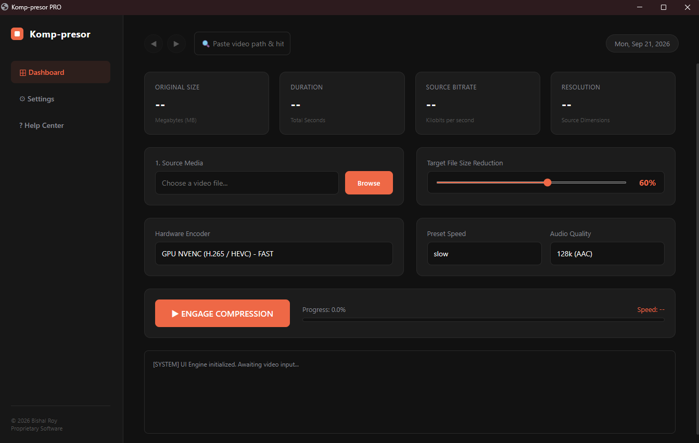
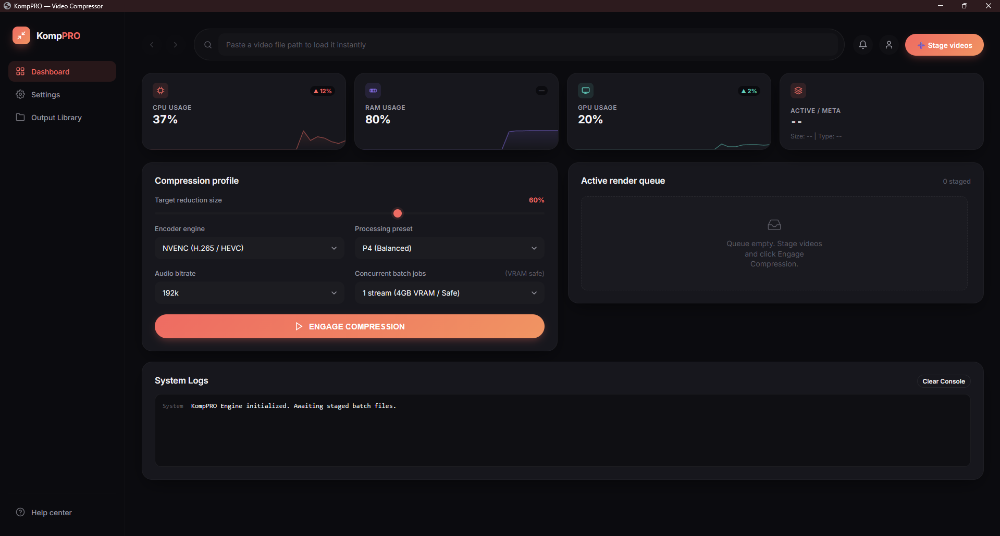

# KompPRO v1.2 — Professional Batch Video Compression Studio

KompPRO v1.2 is the powerful, hardware-accelerated successor to **Komp-presor**. Re-engineered from the ground up, it replaces single-file processing with a robust, studio-grade batch architecture designed to protect system hardware while maximizing throughput.

---

## 📸 Version Comparison & Screenshots

### Previous Version: Komp-presor
The legacy single-file interface featuring basic static counters, a manual single-file browser, and a rigid execution button.

### New Successor: KompPRO v1.2
The modern "Metric Flow" dark dashboard featuring live telemetry graphs, a multi-file staging queue, a master "Engage Compression" trigger, and individual Pause/Resume controls.

## 🚀 Key Technical Updates & Architectural Changes

* **Staged Batch Queue & Master Control ("Engage Compression"):** Unlike older single-file workflows, files are now imported into a staging queue where users can review exact metadata (Duration, File Type, Source Size, and Bitrate) before firing off the master batch sequence.
* **True Pause & Resume System:** Integrated process thread suspension (`psutil`). Pausing a job freezes FFmpeg instantly at its exact frame without terminating the session or losing render progress, allowing users to resume seamlessly.
* **Dynamic Hardware Concurrency Profiling:** Automatically reads system VRAM or CPU core count on startup to assign safe, optimized parallel stream limits (1 to 4 jobs), preventing memory overflow on consumer graphics cards.
* **Self-Healing Smart Fallback System:** Prevents batch stalls. If a video's color profile or codec is rejected by the GPU's NVENC circuit, the engine dynamically reroutes the stream to a pure CPU fallback pipeline (`libx264`).
* **Granular Job Lifecycle Management:** Features individual **Pause/Resume** toggles and permanent **Halt (Abort)** controls for every active file in the render queue.
* **Zero-Window FFprobe Metadata Extraction:** Suppresses background terminal processes (`CREATE_NO_WINDOW`) to eliminate window-flashing and prevent I/O pipe crashes during heavy batch ingestion.

---

## 🛠️ Core Tech Stack
* **Backend:** Python, Eel, Tkinter, `psutil`, `GPUtil`
* **Frontend:** HTML5, Modern CSS (Nightshade/Ember theme), Vanilla JavaScript (Live telemetry graphs)
* **Engines:** FFmpeg / FFprobe (NVIDIA NVENC H.264/HEVC & CPU libx264)

---

## 💻 Installation & Usage
1. Download the latest `KompPRO-v1.2.zip` from the **[Releases](../../releases)** tab.
2. Extract the folder and ensure `ffmpeg.exe` and `ffprobe.exe` are placed alongside `main.exe`.
3. Launch `main.exe`.

---

## 📜 License
This project is open-source software licensed under the [MIT License](LICENSE.txt).
